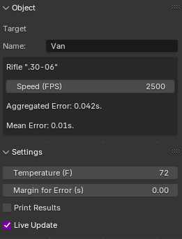
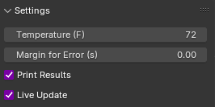

Calcrack: 
=============

3D Crack-Thump Analysis
----------------------------------------

You have many different microphone recordings of a gunshot containing distinct crack and thump elements. They are not time-synchronized. You believe you know where the rifle was located and aimed, but you're not sure. There are some other candidate shooting positions/angles. 

This software is here to rule-out or support candidate shooting location/angle pairs. Simply plot the microphone locations in 3D and enter in the estimated crack-thump delay in seconds for each microphone. Then, place a rifle and a target in the 3D scene. Then, set the rifle to target the target. Then, set the rifle's bullet speed in feet per second and the air temperature of the day the sound was recorded. Finally, either move the target around in the scene or press the "Fire" button to test the candidate rifle location/angle. 

The UI will then display the total aggregated error in seconds as well as the averaged/mean error in seconds. As you add more and more microphones, the aggregated error will inevitably rise, but the mean should not. To find the most likely candidate, keep trying options until the smallest errors are found.

Live Update Mode:
--------------------
To drag a target across the scene and see error results update as you drag, enable Live Update in Calcrack's Scene Settings.

Print Mode:
-------------
To receive the results for each microphone during a test, run Blender from a command prompt/terminal window and enable Print Mode in Calcrack's Scene Settings. The additional data will print to that command prompt/terminal.

Limitations:
--------------
- Currently assumes air friction's effect on bullet velocity is negligible.
- Currently only calculates speed of sound based on air temperature, not on elevation or other considerations.
- This method is not useful if the microphones are located within about 30 meters of the rifle.
- Relies on user supplying candidate solutions, does not itself solve for a solution.

Rebuttals to Objections:
--------------------------
- Clipping: Clipping of the microphones is not a concern because this method relies on arrival time, not on the attributes of what arrives.
- Echoes: Echoes can be mitigated by carefully locating the sound of the thump amidst any possible echoes of the crack. The thump is very loud and deep.
- No Time-synced Mics: This method does not require any microphones to be time-synchronized.
- Bias: This software accelerates candidate testing cadence. This dramatically diffuses potential for bias.
- Crack/Thump Too Close: This method is useful when the rifle is 30+ meters away from the microphones. 

Method Validation:
-------------------
To date, and within 1 week of the software's drafting, the software was tested with one real-world test case. Results were within 2 meters of the actual known shooting angle. This test case included 4 microphones placed in a field where a rifle was fired. The rifle was about 50-140 yards away from the microphones. The microphones were downrange, relatively close to the target. The positions of each microphone, the rifle and the target, were plotted using a calibrated range-finder. All items were on a flat plane with no notable elevation differences.

To contribute a test-case, please contact the owner of this repository at jahenshaw1@gmail.com

History of Calcrack:
-------------------------
Developed in 2026 to investigate the Charlie Kirk assassination.