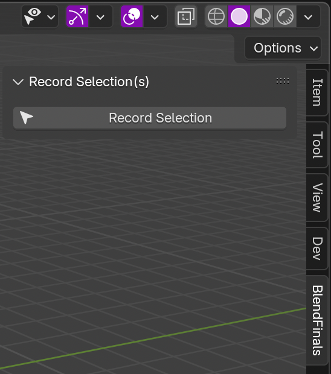
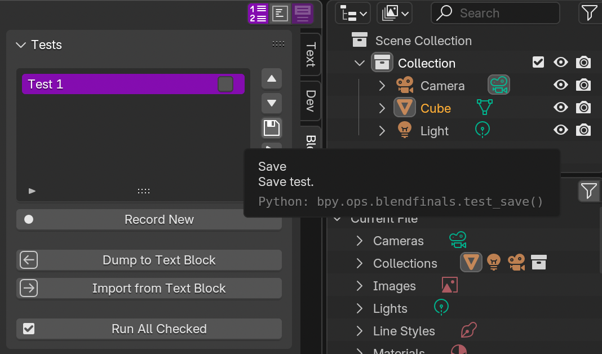
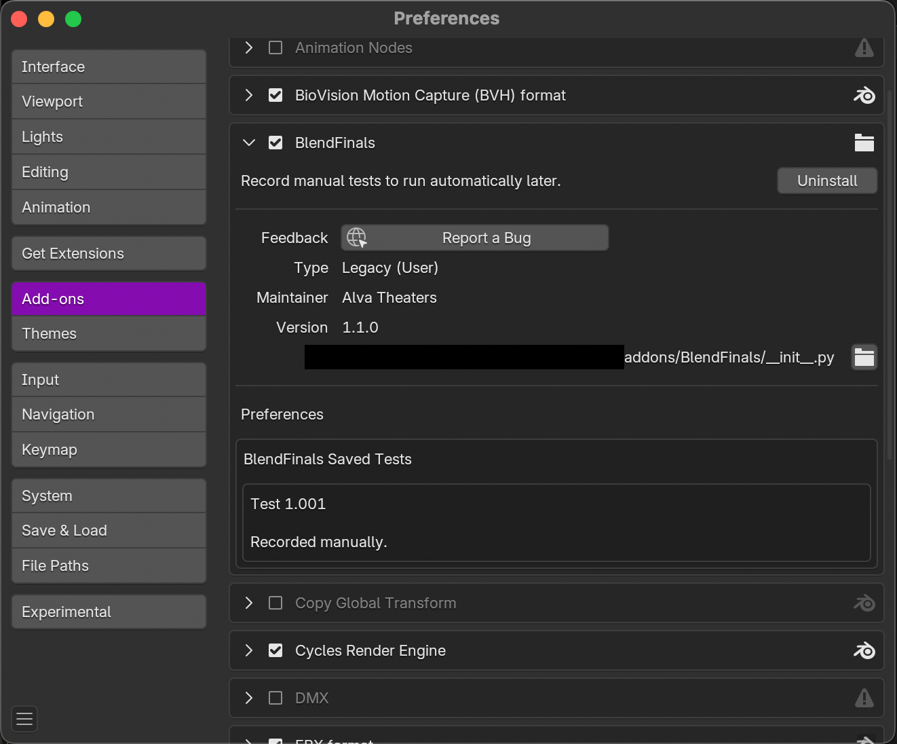
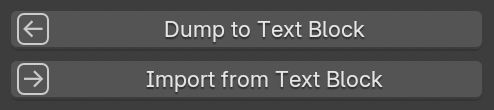
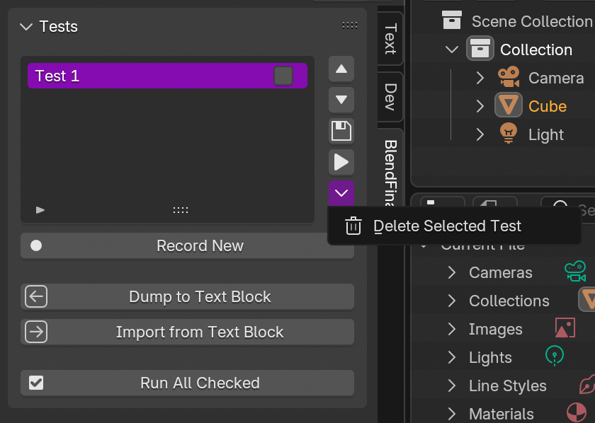

BlendFinals: 
=============

Automated Testing for Blender Add-ons
----------------------------------------

Tired of manually clicking through your Blender add-on after every code change? BlendFinals records real UI interactions, remembers the expected results, and replays them with a single click. Instantly see if your add-on still works as intended. No fragile scripted tests, no guesswork, just fast, repeatable integration testing built right into Blender. This approach is especially effective for add-ons that produce network messages, as those outputs are easy to capture, store, and compare.


Problem to Solve:
------------------
“How do we do integration testing in Blender without manually stitching together user interaction patterns programmatically, step by step?”


Solution:
-----------
Record real interactions through Blender's UI using the Info window. Use a hook to tell add-ons to start recording a KPI (e.g., a string representing the result of the add-on's behavior) on their side. When finished simulating a user pattern, save the recording to memory, including the KPI returned by the hook from the add-on. That's the correct test answer. Then, a month later when it's time to test, the user runs the test. If the KPI is unchanged, the integration test passes. If it changed, a diff is printed to the command line.


How Does the Hook Work?
--------------------------
BlendFinals adds itself to the modules in sys. This means that once BlendFinals is installed into Blender, add-on developers can access it in Blender's Python environment (e.g., Terminal or Text Editor) using "import blendfinals". To add a hook to an add-on, use the template in python_templates.py. It works the exact same way as adding a Panel or Operator to Blender. 

Inside the "blendfinals.types.Hook" mix-in class are start_test() and end_test() methods. These are called by BlendFinals through the BlendFinals UI. Use end_test() to return the add-on's KPI.

```python
import blendfinals


class BLENDFINALS_hk_a_hook(blendfinals.types.Hook):
    bf_idname = 'sample_hook'
    bf_label = "Hook"
    bf_description = "Hooks another 3rd party add-on to BlendFinals for UI-based integration-testing automation."

    def start_test() -> None:
        # Do something like enable an OSC output recorder in your add-on.
        pass


    def end_test() -> str:
        # Do something like disable the OSC recorder.
        # Then, return its output to BlendFinals as string.
        return "This is the right answer."

    def on_test_fail() -> None:
        # Put your add-on into a debug mode, for example.
        pass
        
        
def register():
    blendfinals.utils.register_class(BLENDFINALS_hk_a_hook)  # Add hook to BlendFinals' internal data.

    
def unregister():
    blendfinals.utils.unregister_class(BLENDFINALS_hk_a_hook)


if __name__ == '__main__':
    register()
```


Limitations:
--------------
To record user UI interactions, BlendFinals relies on Blender's built-in Info editor. If a certain action is not recorded by the Info editor, BlendFinals will not know to reproduce the action in the test later. A dominant example of this problem is selection of objects in 3D View. If selections are changed while recording a test, utilize the "Record Selection" button in the BlendFinals side panel in 3D View.



Failure to do so may cause the test to fail falsely later.


Memory:
---------
BlendFinals is equipped with local memory between Blender sessions. Press the Save button (floppy disk icon) to store a test to local memory:



View saved tests in Blender Preferences where BlendFinals is displayed as an add-on:




Accessing Test Data Directly:
-------------------------------
Retrieve the exact test instructions from existing tests using the "Dump to Text Block" button in the Text Editor side panel. To save a text block as a set of test instructions, press the "Import from Text Block" button and a new test will appear.



At this time, an add-on's response to the test, or its KPI, cannot be retrieved or overwritten in this way. For a similar effect, run the test's instructions as a standalone Python script while recording a new test.


Deleting Tests:
-------------------
To reduce accidental deletions, the button for deleting tests is hidden in the chevron pop-up:




Run All Tests:
---------------
To run multiple tests in order at the click of a button, press the "Run All Checked" button. This will run all tests with their checkboxes checked in chronological order. Re-order them using the up arrow and down arrow buttons to the right of the tests box.


History of BlendFinals:
-------------------------
BlendFinals was developed specifically for the development of Alva Sorcerer, the flagship Blender add-on of Alva Theaters. This solution was needed to replace an impossibly arduous process of manually proofing Sorcerer's hundreds of separate tools. Sorcerer needed a way to store exhaustive test interaction patterns automatically without writing them out line by line. BlendFinals also keeps tests up to date with the latest functional changes.